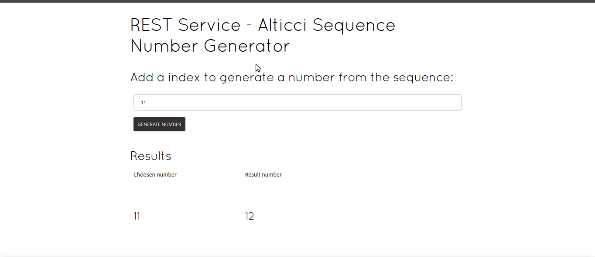

<p align="center">
  <h1 align="center" >Alticci Rest Api Sequence Number</h1>
</p>

## 🧪 How does it work? Check it out!

<p align="center">
  
</p>

<br>

## 🔖 Web application

You can view the project layout here

*Web app using Angular CDN:* http://localhost:4000

## 🧪 Technologies

This project was developed using the following technologies:

- [Angular (CDN)](https://angular.io)
- [Quarkus](https://quarkus.io)
- [Quarkus Cache Extension](https://react.semantic-ui.com/)
- [Quarkus Swagger OpenAPI Extension](https://quarkus.io/guides/openapi-swaggerui)


## 🚀 Getting started

Clone the project and access the folder.

The public URL can be found here: 

*Deployed version:* deployment-link

https clone public link 
```bash
$ git clone https://github.com/g-santosmartins/rest-alticci-api.git

```

SSH clone public link

```bash
$ git clone git@github.com:g-santosmartins/rest-alticci-api.git

```
Make sure that you have quarkus CLI installed:

```bash
# To make sure, run:
quarkus -v

```

If you've not installed quarkus CLI yet I strongly recommend this guide:

### https://quarkus.io/get-started/

Follow the steps below:
```bash
# Install the dependencies
quarkus dev

```


## 🔖 Documentation OpenAPI 3 - Swagger

You can get into the API documentation easly using this path:

*Documentation link:* http://localhost:4000/api-docs


Local Quarkus development server (GET):

*Localhost version:* http://localhost:4000/v1/alticci/10

## 📝 License

This project is licensed under the MIT License. See the [LICENSE](LICENSE.md) file for details.

---

<p align="center">Made with ❤️ by Guilherme Martins</p>